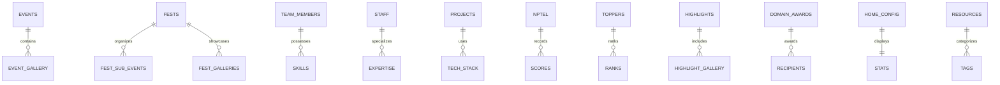
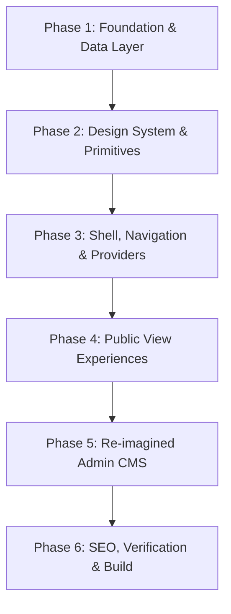

# SHAIDS v2.0 Master Architectural Blueprint
### Agent Engineering Guide for Complete UI/UX Re-imagination with Core Functional Parity

> **Target Audience**: AI Agents (and senior full-stack engineers) tasked with building **v2.0** of the **SHAIDS** web platform.  
> **Mission**: Build a completely fresh, next-generation UI/UX design from scratch while retaining **100% functional, operational, and data compatibility** with the existing v1.0 architecture.

---

## Table of Contents

1. [Executive Vision & Project Identity](#1-executive-vision--project-identity)
2. [The Invariant Core (What Must Never Change)](#2-the-invariant-core-what-must-never-change)
3. [Data Architecture & Schema Contracts (Supabase)](#3-data-architecture--schema-contracts-supabase)
4. [The 3-Tier Synchronization Engine](#4-the-3-tier-synchronization-engine)
5. [Route Matrix & Page Experience Contracts](#5-route-matrix--page-experience-contracts)
6. [Admin Panel & Content Management System (CMS)](#6-admin-panel--content-management-system-cms)
7. [UI/UX Re-Imagination Directives for v2.0](#7-uiux-re-imagination-directives-for-v20)
8. [Agent Implementation Roadmap (Step-by-Step)](#8-agent-implementation-roadmap-step-by-step)
9. [Critical Gotchas, Edge Cases & Technical Hazards](#9-critical-gotchas-edge-cases--technical-hazards)
10. [Reference Defaults & Fallback Data](#10-reference-defaults--fallback-data)

---

## 1. Executive Vision & Project Identity

### 1.1 What is SHAIDS?
**SHAIDS** (**S**tudent **H**ub for **A**rtificial **I**ntelligence & **D**ata **S**cience) is the official digital ecosystem for the **Department of Artificial Intelligence & Data Science (AI & DS)** at **A. C. Patil College of Engineering (ACPCE)**, Navi Mumbai, India.

### 1.2 Core Audiences
1. **Current Students**: Access learning resources, view hackathons/workshops, register for events, explore research capstones, review fest schedules, and look up committee leadership.
2. **Faculty & Administration**: Showcase departmental milestones, faculty research portfolios, NPTEL rankings, and academic toppers.
3. **Prospective Students & Recruiters**: Discover department caliber, syllabus rigor, student projects, coding culture, and annual fests.
4. **Student Council Admins**: Live-edit all website content without code changes via a secure, zero-latency admin dashboard.

### 1.3 The v2.0 Objective
- **UI/UX**: Completely free to innovate. Can adopt brutalist typography, ultra-modern bento grids, modular minimalist layouts, interactive 3D elements, or a sleek light-first design.
- **Functionality**: Must maintain strict parity with all 12 data types, the 3-tier sync engine, academic year segmentation, admin CRUD workflows, image cropping, and SEO endpoints.

---

## 2. The Invariant Core (What Must Never Change)

Any implementation of v2.0 **MUST** uphold these core behaviors:

| Functional Area | Invariant Contract |
|---|---|
| **Data Provider** | Must consume and update the 12 Supabase PostgreSQL tables using the defined column schemas. |
| **Realtime Sync** | UI must instantly reflect admin edits across tabs without page reloads (WebSocket + BroadcastChannel). |
| **Academic Year Switch** | Must support toggling between `2026-27` and `2025-26` academic sessions for Team, Projects, Highlights, and NPTEL data. |
| **Admin Control** | Credential-protected `/admin` interface supporting full CRUD, drag-to-reorder, and canvas-based image cropping. |
| **Routing Parity** | Must preserve the 27 canonical URL routes to prevent breaking external backlinks, QR codes, and search indices. |
| **Offline Resilience** | If Supabase is unreachable or unconfigured, the app must gracefully render fallback mock data without crashing. |

---

## 3. Data Architecture & Schema Contracts (Supabase)

All tables live in the `public` schema of Supabase PostgreSQL. RLS is enabled with permissive public read/write access.

### 3.1 The 12 Core Entities



#### 1. `events`
Workshops, hackathons, seminars, industrial visits, and technical events.
```typescript
interface EventItem {
    id: string;                  // UUID
    title: string;               // Event headline
    description: string;         // Short card description
    long_description?: string;   // Markdown / rich details
    date: string;                // Start date (YYYY-MM-DD or formatted)
    end_date?: string;           // Optional multi-day end date
    time?: string;               // e.g., "10:00 AM - 04:00 PM"
    location: string;            // e.g., "Auditorium / Seminar Hall 4"
    image_url?: string;          // Banner image URL
    type?: string;               // 'Workshop' | 'Hackathon' | 'Seminar' | 'Industrial Visit'
    category?: string;           // 'Technical Event' | 'Hands-on' | 'Guest Lecture'
    organizer?: string;          // e.g., "SHAIDS Core Team"
    brochure_url?: string;       // PDF flyer URL in Supabase Storage
    registration_url?: string;   // External Google Form / Unstop link
    has_registration: boolean;   // Controls CTA visibility
    is_past: boolean;            // Overrides automatic completion calculation
    academicYear?: AcademicYear; // '2026-27' | '2025-26'
    gallery_images?: string[];   // Array of post-event photo URLs
}
```

#### 2. `team`
Student council committee members and department ambassadors.
```typescript
interface TeamMember {
    id: string;                  // UUID
    name: string;                // Member full name
    role: string;                // e.g., "President", "Tech Lead", "Creative Head"
    category?: string;           // 'Core Office Bearers' | 'Technical' | 'Design' | 'PR & Social' | 'Logistics'
    image_url?: string;          // Profile portrait URL
    github?: string;             // GitHub profile URL
    linkedin?: string;           // LinkedIn profile URL
    instagram?: string;          // Instagram profile URL
    email?: string;              // Contact email
    bio?: string;                // Bio or elevator pitch
    graduation_year?: string;    // e.g., "2027"
    academicYear?: AcademicYear; // '2026-27' | '2025-26'
    skills?: string[];           // Tags: ['PyTorch', 'Next.js', 'System Design']
    achievements?: string[];     // Bulleted list of awards
    display_order?: number;      // Manual sort sequence
    created_at?: string;         // Used for fallback drag sort order
}
```

#### 3. `staff`
Department faculty, professors, and lab assistants.
```typescript
interface StaffMember {
    id: string;                  // UUID
    name: string;                // Faculty full name
    designation: string;         // e.g., "Head of Department", "Assistant Professor"
    department?: string;         // Defaults to "Artificial Intelligence & Data Science"
    qualification?: string;      // e.g., "Ph.D (Computer Science), M.Tech"
    expertise?: string[];        // Tags: ['Deep Learning', 'Computer Vision', 'NLP']
    email?: string;              // Official ACPCE institutional email
    image_url?: string;          // Faculty photograph URL
    bio?: string;                // Research interest statement
    display_order?: number;      // Manual display order
    created_at?: string;         // Used for fallback drag sort order
}
```

#### 4. `resources`
Curated study materials, roadmaps, question banks, and developer tools.
```typescript
interface ResourceItem {
    id: string;                  // UUID
    title: string;               // Material title
    description: string;         // Summary of contents
    category: string;            // 'Semester Notes' | 'Roadmaps' | 'Lab Manuals' | 'Question Banks' | 'Cheat Sheets'
    link: string;                // Google Drive, GitHub, or download URL
    tags?: string[];             // ['SEM-5', 'Machine Learning', 'PDF']
    author?: string;             // Creator / contributor credit
}
```

#### 5. `projects`
Student research papers, Capstone final-year innovations, and semester projects.
```typescript
interface ProjectItem {
    id: string;                  // UUID
    title: string;               // Project name
    category: string;            // 'Computer Vision' | 'NLP' | 'Healthcare AI' | 'Autonomous Systems'
    abstract: string;            // Problem statement and methodology
    team: string[];              // Team member names ['Vedant M.', 'Rahul S.']
    advisor: string;             // Faculty guide name
    techStack: string[];         // ['TensorFlow', 'FastAPI', 'React', 'Docker']
    image: string;               // Project teaser image URL
    gallery: string[];           // Additional screenshot URLs
    academicYear?: AcademicYear; // '2026-27' | '2025-26'
    github?: string;             // Source code repository URL
    demo?: string;               // Live deployment URL
}
```

#### 6. `nptel`
National Programme on Technology Enhanced Learning (NPTEL/SWAYAM) certifications.
```typescript
interface NptelItem {
    id: string;                  // UUID
    name: string;                // Student / Faculty candidate name
    course: string;              // Course title (e.g., "Deep Learning", "Data Mining")
    cert: string;                // 'Elite + Gold' | 'Elite + Silver' | 'Elite' | 'Successfully Completed'
    score: string;               // Percentage or mark (e.g., "94%")
    year: string;                // e.g., "2026"
    academicYear?: AcademicYear; // '2026-27' | '2025-26'
    isFaculty?: boolean;         // Distinguishes faculty topper from student
}
```

#### 7. `highlights`
Inter-collegiate hackathon victories, patent filings, research publication awards.
```typescript
interface HighlightItem {
    id: string;                  // UUID
    title: string;               // Milestone headline
    category: string;            // 'Hackathon Win' | 'Research Paper' | 'Patent' | 'State Award'
    team: string;                // Winning student/team names
    location: string;            // Venue or host institute
    date: string;                // Event date
    description: string;         // Achievement context
    achievement?: string;        // e.g., "1st Runner Up (Cash Prize: ₹50,000)"
    image: string;               // Trophy / ceremony photograph
    gallery: string[];           // Additional ceremony photos
    academicYear?: AcademicYear; // '2026-27' | '2025-26'
}
```

#### 8. `fest_sub_events`
Individual competition brackets and tournaments across the 3 annual fests.
```typescript
interface FestSubEvent {
    id: string;                  // UUID
    festId: 'vectors' | 'kurukshetra' | 'rhythms';
    title: string;               // Competition title (e.g., "Code Clash", "Box Cricket")
    organizer: string;           // Student lead / sub-coordinator
    winner: string;              // 1st place individual / team name
    runnerUp: string;            // 2nd place individual / team name
    desc: string;                // Short description of rules
    detailedInfo: string;        // Full rules, prize breakdown, schedule
    image: string;               // Event badge or thumbnail
    academicYear?: AcademicYear; // '2026-27' | '2025-26'
    eventGallery: string[];      // Photos from this sub-event
}
```

#### 9. `fest_galleries`
Full photo collections for the 3 flagship festivals.
```typescript
interface FestGalleries {
    vectors: string[];       // Array of image URLs for VECTORS (Tech Fest)
    kurukshetra: string[];   // Array of image URLs for KURUKSHETRA (Sports Meet)
    rhythms: string[];       // Array of image URLs for RHYTHMS (Cultural Fest)
}
```

#### 10. `toppers`
Semester-wise academic GPA rank holders.
```typescript
interface TopperItem {
    id: string;                  // UUID
    semType: 'Odd' | 'Even';     // Semester cycle
    yearBatch: 'SE' | 'TE' | 'BE'; // Second Year, Third Year, Final Year
    rank: string;                // 'Rank 1' | 'Rank 2' | 'Rank 3'
    name: string;                // Student name
    sgpa: string;                // Semester GPA (e.g., "9.85")
}
```

#### 11. `domain_awards`
Excellence recognition in specific sub-domains.
```typescript
interface DomainAwardItem {
    id: string;                  // UUID
    title: string;               // e.g., "Best AI Researcher 2026"
    recipient: string;           // Recipient name
    domain: string;              // 'Computer Vision' | 'Open Source' | 'Data Science'
}
```

#### 12. `home_config`
Global dynamic settings displayed across the landing page.
```typescript
interface HomeConfig {
    hero_headline: string;       // Main hero headline
    hero_subtitle: string;       // Subtitle under headline
    announcement_text: string;   // Floating banner marquee message
    about_text: string;          // Department introduction statement
    stat_members: string;        // e.g., "250+"
    stat_events: string;         // e.g., "18+"
    stat_workshops: string;      // e.g., "12+"
    image_events?: string;       // Featured event showcase image
    image_team?: string;         // Featured committee showcase image
    image_resources?: string;    // Featured resources showcase image
    image_staff?: string;        // Featured faculty showcase image
}
```

### 3.2 Storage Bucket (`shaids-assets`)
- **Bucket ID**: `shaids-assets` (Public access enabled).
- **Sub-folder Conventions**:
  - `events/` – Banners and brochure PDFs
  - `team/` – Student portrait avatars
  - `staff/` – Faculty portrait photographs
  - `fest/` – Fest marquee photos and sub-event winners
  - `projects/` – Capstone previews and screenshots
- **Cleanup Rule**: When an image is replaced or an item is deleted in admin, call `deleteMediaFile(url)` to prevent orphaned assets from consuming cloud storage.

---

## 4. The 3-Tier Synchronization Engine

The platform must maintain real-time sync with zero latency and robust failure tolerance.

```
┌─────────────────────────────────────────────────────────────┐
│                       Browser Tab A                         │
│                                                             │
│   User edits Event in Admin -> Calls saveEvent(payload)     │
│             │                               │               │
│             ▼                               ▼               │
│     Supabase REST API            BroadcastChannel API       │
│    (Updates DB Table)         ('shaids-content-sync')       │
│             │                               │               │
└─────────────┼───────────────────────────────┼───────────────┘
              │                               │ Instant cross-tab sync
              ▼ WSS                           ▼ (No network overhead)
    Supabase Realtime Channel       ┌─────────────────────────┐
    (postgres_changes on all 12 tbl)│      Browser Tab B      │
              │                     │                         │
              └────────────────────►│  Content Context Auto-  │
                                    │  Patches In-Memory State│
                                    └─────────────────────────┘
```

### 4.1 Tier Breakdown
1. **Tier 1: Supabase Realtime (WebSocket)**
   - Listens on `postgres_changes` across all 12 tables (`event: '*'`).
   - On incoming changes, updates or refetches the specific table to keep stale tabs fresh.
2. **Tier 2: BroadcastChannel API (`shaids-content-sync`)**
   - Transmits immediate `{ type: 'PATCH', table, eventType, item }` events between open browser tabs on the same origin.
   - Admin changes show up on the public tab within **0 ms** without waiting for round-trip WebSocket packets.
3. **Tier 3: 2-Second Fallback Polling Loop**
   - Guards against dropped WebSocket connections on unstable college Wi-Fi or high-latency mobile networks.
   - Throttled with in-flight lock promises to prevent hammering the Supabase REST endpoint.

### 4.2 Drag-to-Reorder Persistence Engine
- When team or staff cards are dragged into a new visual order, compute new sequential `created_at` or `display_order` values.
- Persist the batch updates to Supabase so that the custom ordering is saved permanently for all visitors.

---

## 5. Route Matrix & Page Experience Contracts

All public and administrative routes **MUST** be implemented in v2.0:

| Path | Rendering | Experience Contract |
|---|---|---|
| `/` | Static (○) | **Homepage**: Hero brand statement, stats counters, announcement banner, about teaser, alternating feature showcase panels. |
| `/about` | Static (○) | Redirects automatically to `/about/overview`. |
| `/about/overview` | Static (○) | **Overview**: Department vision, mission statements, lab facilities, and institutional strengths. |
| `/about/messages` | Static (○) | **Leadership Messages**: Head of Department (HOD) and College Principal address to students. |
| `/about/achievements` | Static (○) | **Achievements Hub**: Central portal linking to highlights, NPTEL, and capstones. |
| `/about/achievements/highlights` | Static (○) | **Highlights**: Hackathon victories, patent filings, awards, and photo galleries. |
| `/about/achievements/nptel` | Static (○) | **NPTEL Hub**: Certification leaderboard, Elite/Gold rankings, faculty & student filters. |
| `/about/achievements/projects` | Static (○) | **Capstones**: Research projects, tech stack badges, team credits, GitHub & demo links. |
| `/events` | Static (○) | **Events Directory**: Filterable by category, upcoming vs past toggle, search bar. |
| `/events/[id]` | Dynamic (ƒ) | **Event Details**: Multi-day dates, venue, timing, brochure download, snapshot photo gallery with lightbox. |
| `/events/fests/vectors` | Static (○) | **VECTORS Fest**: Technical symposium portal, sub-event competitions, winners, photo marquee. |
| `/events/fests/kurukshetra` | Static (○) | **KURUKSHETRA Fest**: Sports meet portal, brackets, tournament winners, sports gallery. |
| `/events/fests/rhythms` | Static (○) | **RHYTHMS Fest**: Cultural extravaganza, dance/music/arts results, fest marquee. |
| `/resources` | Static (○) | **Resources Hub**: Curated notes, syllabi, cheat sheets, roadmaps with category tabs and search. |
| `/resources/[id]` | Dynamic (ƒ) | **Resource Detail**: Detailed preview and direct download/visit action. |
| `/team` | Static (○) | **Committee Directory**: Filterable by academic year (`2026-27` / `2025-26`) and functional roles. |
| `/team/[id]` | Dynamic (ƒ) | **Team Profile**: Detailed view of student member, skills, portfolio links, and achievements. |
| `/team/individual/[id]`| Dynamic (ƒ) | Alias deep-link for individual profile view. |
| `/staff` | Static (○) | **Faculty Directory**: Professor grid with designations, research domains, and ACPCE emails. |
| `/staff/[id]` | Dynamic (ƒ) | **Faculty Profile**: Detailed biography, research expertise, qualifications, and publications. |
| `/admin` | Protected (○)| **CMS Dashboard**: Comprehensive CRUD panel for all 12 tables with live preview. |
| `/admin/login` | Static (○) | **Admin Authentication**: Passcode login gate. |
| `/robots.txt` | Static (○) | Directs bots to allow public pages and disallow `/admin/` and `/api/`. |
| `/sitemap.xml` | Static (○) | Dynamic XML sitemap containing all verified public URLs. |

---

## 6. Admin Panel & Content Management System (CMS)

The admin panel at `/admin` must remain functional regardless of how the UI is redesigned:

### 6.1 Authentication & Security
- Gate access using `NEXT_PUBLIC_ADMIN_PASSWORD`.
- Store session state in `localStorage` or session cookies with automatic inactivity logout.
- Keep login UI clean and distinct from the public website.

### 6.2 Mandatory Admin Capabilities
1. **Full CRUD for 12 Entities**:
   - Create, edit, and delete items across: Events, Team, Staff, Resources, Projects, NPTEL, Highlights, Fest Sub-events, Fest Galleries, Toppers, Domain Awards, and Home Config.
2. **Interactive Image Cropper**:
   - Modal canvas allowing admins to crop uploaded images before sending to Supabase Storage:
     - 1:1 square aspect ratio lock for profile avatars (Team & Staff).
     - 16:9 banner aspect ratio for Events and Highlights.
     - Free-form / custom crop for gallery photographs.
3. **Drag-to-Reorder**:
   - Draggable handles on Team and Staff lists that save their order on drag release.
4. **Academic Year Switcher in Admin**:
   - Allows council members to curate either current (`2026-27`) or past (`2025-26`) records.
5. **Instant Live Preview**:
   - Because of the 3-tier sync, an admin can keep the public site open in Tab A, edit in Tab B, and watch Tab A update in real time.

---

## 7. UI/UX Re-Imagination Directives for v2.0

As an agent designing v2.0, you are **encouraged to break away** from v1.0's design. Here is the comparative matrix of what v1.0 used vs what v2.0 can adopt:

### 7.1 v1.0 Design Audit vs v2.0 Creative Opportunities

| Design Attribute | v1.0 Implementation | v2.0 Creative Concepts |
|---|---|---|
| **Theme / Colors** | Deep space black with electric neon purple & cyan OKLCH | High-contrast brutalist monochrome; Clean Swiss minimal light theme; Warm cyberpunk slate & amber; Linear-style polished dark mode. |
| **Cards & Layouts** | Uniform `rounded-[2.5rem]` glassmorphic cards with blur | Modular Bento Grids with variable cell heights; Sharp architectural borders (`border-2`); Clean frameless whitespace layouts. |
| **Typography** | Geist Sans & Geist Mono | Syne, Outfit, Inter Display, Space Grotesk, Plus Jakarta Sans, or Playfair/Editorial Serif accents. |
| **Hero Section** | Cycling logo morph with primary CTA pills | Interactive 3D particle canvas (Three.js/Spline); Terminal command prompt; Bold oversized kinetic typography; Split-screen media reel. |
| **Event Showcase** | Card grid with category badge pills | Interactive horizontal timeline; Calendar grid with day popovers; Matrix view with live search filtering. |
| **Fest Pages** | Marquee photo carousel with ambient spotlights | Interactive 3D stage map; Editorial magazine layout with full-bleed photo spreads; Immersive audio-reactive sound clips. |
| **Navigation** | Floating pill navbar with layoutId underline | Dock-style bottom navigation; Dynamic HUD header with live status indicators; Minimal drawer with full-screen menu overlay. |

### 7.2 High-Value Feature Additions for v2.0
- **Global Search (`Cmd + K` Command Palette)**: Instant fuzzy search across events, resources, staff, and team.
- **Save / Bookmark System**: Save learning resources and upcoming events to `localStorage`.
- **Calendar Export**: "Add to Google Calendar" / `.ics` download for upcoming workshops and hackathons.
- **Interactive Student Skill Matrix**: Graph visualization or filterable tag cloud connecting team members to their tech stacks.
- **AI Syllabus Assistant**: Embedded lightweight interface for students to ask questions about department resources.

---

## 8. Agent Implementation Roadmap (Step-by-Step)

When implementing v2.0, follow this phased execution plan:



### Phase 1: Foundation & Data Layer
1. Retain or adapt `src/lib/supabase.ts` and `src/context/content-context.tsx`.
2. Verify all 12 TypeScript interfaces match Section 3 of this document.
3. Validate that environment variables (`NEXT_PUBLIC_SUPABASE_URL`, `NEXT_PUBLIC_SUPABASE_ANON_KEY`, `NEXT_PUBLIC_ADMIN_PASSWORD`) are properly read.

### Phase 2: Design System & Primitives
1. Establish the new design identity (color palette tokens, typography font families in `layout.tsx` and `globals.css`).
2. Build core UI primitives (Button, Card, Badge, Modal, Tabs, Input, Select, ImageLightbox).
3. Ensure all components support dark and light mode seamlessly.

### Phase 3: Shell, Navigation & Providers
1. Set up the root `layout.tsx` with font imports, `ThemeProvider`, `QueryProvider`, and `ContentProvider`.
2. Construct the new navigation (Navbar, Mobile Menu, Footer, Academic Year Switcher).
3. Test that route group `(public)` houses all public pages and leaves `src/app/` free of route collisions.

### Phase 4: Public View Experiences
1. **Home**: Implement hero, live stats, announcements, and feature showcases.
2. **About & Achievements**: Build overview, messages, milestones, NPTEL tracker, and Capstone projects.
3. **Events & Fests**: Build the event directory, dynamic `[id]` detail views, and dedicated fest hubs (`vectors`, `kurukshetra`, `rhythms`).
4. **Community**: Build the team committee and faculty staff directories with detail profile views.
5. **Resources**: Build the study materials hub with category filtering and search.

### Phase 5: Re-imagined Admin CMS
1. Implement the password-protected `/admin` interface.
2. Build entity management forms for all 12 content categories.
3. Integrate the canvas-based image cropper and upload pipeline into `shaids-assets`.
4. Ensure drag-to-reorder works smoothly.

### Phase 6: SEO, Verification & Build
1. Update `robots.ts` and `sitemap.ts` to include all verified public routes.
2. Run `npx tsc --noEmit` to ensure 0 TypeScript errors.
3. Run `npm run build` using Turbopack to verify all 22 static pages compile with 0 warnings.
4. Test real-time sync across two browser windows.

---

## 9. Critical Gotchas, Edge Cases & Technical Hazards

### 9.1 Next.js App Router Route Group Collisions
- **Hazard**: Do NOT create a `src/app/page.tsx` if you have `src/app/(public)/page.tsx`. Next.js considers `(group)/page.tsx` as resolving to `/`. Having both causes build failures.
- **Rule**: Keep all public pages inside `(public)` and admin pages inside `admin/`.

### 9.2 Image Optimization & Remote Domains
- When loading remote images from Unsplash or Supabase Storage, ensure `next.config.ts` includes the necessary `remotePatterns`:
  ```typescript
  remotePatterns: [
    { protocol: 'https', hostname: '*.supabase.co', pathname: '/storage/v1/object/public/**' },
    { protocol: 'https', hostname: 'images.unsplash.com', pathname: '/**' },
    { protocol: 'https', hostname: 'avatars.githubusercontent.com', pathname: '/**' }
  ]
  ```

### 9.3 Date Parsing and Multi-Day Completion
- Always compare event dates against end of day in local time:
  ```typescript
  const targetDate = new Date((event.end_date || event.date) + 'T23:59:59').getTime();
  const isCompleted = Date.now() > targetDate;
  ```

### 9.4 Memory Leaks in Realtime Subscriptions
- Always unsubscribe from channels and close BroadcastChannels inside `useEffect` cleanup hooks:
  ```typescript
  useEffect(() => {
    const channel = supabase.channel('content_sync').subscribe();
    const bc = new BroadcastChannel('shaids-content-sync');
    return () => {
      supabase.removeChannel(channel);
      bc.close();
    };
  }, []);
  ```

---

## 10. Reference Defaults & Fallback Data

When Supabase is disconnected, the context must default to safe fallback configurations:

```typescript
export const DEFAULT_HOME_CONFIG: HomeConfig = {
    hero_headline: 'Empowering Tomorrow with AI & Data Science',
    hero_subtitle: 'Department of Artificial Intelligence & Data Science Student Council',
    announcement_text: '🚀 Tech Symposium 2026 Registration Open Now!',
    about_text: 'SHAIDS is dedicated to fostering innovation, technical growth, and collaborative learning across all batches.',
    stat_members: '250+',
    stat_events: '18+',
    stat_workshops: '12+',
    image_events: 'https://images.unsplash.com/photo-1540575467063-178a50c2df87?w=1200&q=80',
    image_team: 'https://images.unsplash.com/photo-1522071820081-009f0129c71c?w=1200&q=80',
    image_resources: 'https://images.unsplash.com/photo-1434030216411-0b793f4b4173?w=1200&q=80',
    image_staff: 'https://images.unsplash.com/photo-1524178232363-1fb2b075b655?w=1200&q=80'
};
```

---

*Blueprint prepared for the SHAIDS v2.0 development team — Department of AI & Data Science, ACPCE Navi Mumbai.*
